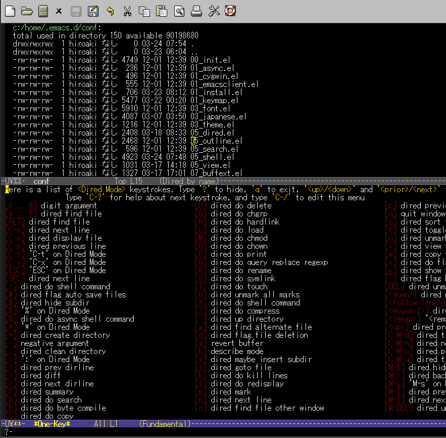

What's this?
============

This is a extension of Emacs that provides the menu of one-key.el for any major-mode and minor-mode.

Feature
=======

One-key.el is a awesome extension of Emacs that provides help menu of key binding.  
But it has some bad points. List them at the following ...  

* A troublesome setting is required in order to define the menu for any mode other than global-mode.
* The extension exists which provide the output of its code. But if key binding has changed, have to redo a output.
* Have to do setting for each for the key binding which has prefix key.

This extension resolve them.

### Define the menu for any major-mode and minor-mode easily

You can define the menu for any major-mode and minor-mode by writting one line.

### Define the menu automatically for each for the key binding which has prefix key

For example, dired-mode has some keymaps "C-t", "C-x", etc.  
You can define the menu for them by writting one line.

### Define the menu for all active mode at that time.

When want to know key binding on some mode,  
I think that want to know the binding of all active mode at that time.  
So, define the menu automatically for them.

Install
=======

You can install by the following way.

### By auto-install

eval the following sexp.

    (auto-install-from-url "https://raw.github.com/aki2o/one-key-local/master/one-key-local.el")

### Otherwise

download "one-key-local.el" manually and put it in your load-path.

Configure
=========

    (require 'one-key-local)

    ;; if the mode has hook
    (one-key-local-create-menu :hook 'dired-mode-hook :key nil :bind "?")

    ;; if the mode has not hook
    (one-key-local-create-menu :mode 'moccur-mode :key nil :bind "<f11>")

    ;; if the map name different the mode name
    (one-key-local-create-menu :mode 'moccur-grep-mode :map 'moccur-mode-map :key nil :bind "?")

    ;; if want to display the menu for specified key map
    (one-key-local-create-menu :hook 'org-mode-hook :key "C-c C-x" :bind "C-c C-x")

Notice
======

### More information

If you want to get more information of one-key-local-create-menu, do describe-function.

### The key map exists that can't be defined automatically

If you received the following message,  

    [OneKeyLocal] Not yet create menu 'XXX' on ...

Write setting "(one-key-local-create-menu ..." about XXX before the menu.  
The cause has not yet been elucidated.

### The menu isn't displayed which is about Return key and Escape key

For example, if you wrote the following ...

    (one-key-local-create-menu :hook 'dired-mode-hook :key nil :bind "<f11>")

Then, if you keystroke "&lt;f11&gt;" on dired-mode, display the following ...

Then, if you keystroke "C-t", show the "C-t" menu.  
But, if you keystroke "<ESC>", not show the "<ESC>" menu.  

I guess the cause is specification of one-key.el.

If you want to show the menu about Return key and Escape key,  
In above case, write like the following ...

    (one-key-local-create-menu :hook 'dired-mode-hook :key "<ESC>" :bind "<M-f11>")

Tested On
=========

* Emacs ... GNU Emacs 23.3.1 (i386-mingw-nt5.1.2600) of 2011-08-15 on GNUPACK
* one-key.el ... Version 0.7.1

Enjoy!!!

